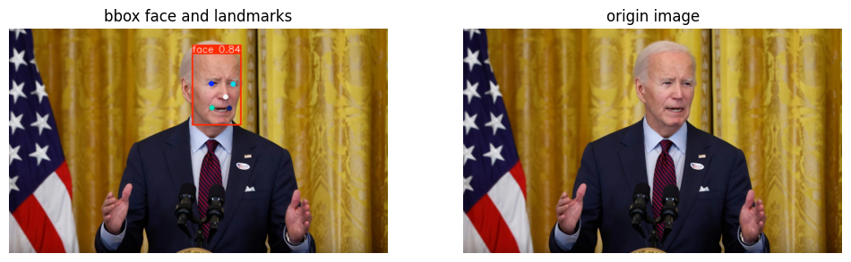
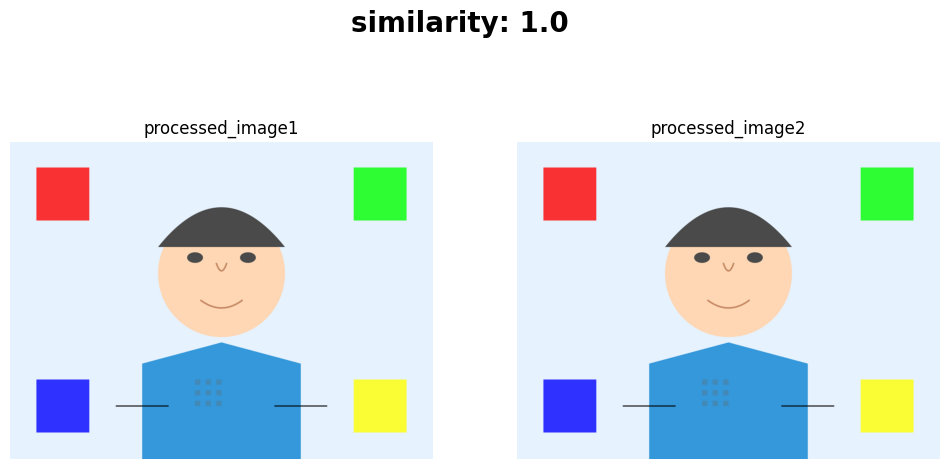

# AI-engineer-Hivo-test


## Table of Contents
  - [Introduction](#introduction)
  - [Installation](#installation)
  - [Resources](#resources-and-tools)
  - [Jupyter Notebook Examples](#jupyter-notebook-examples)
  - [Getting Started](#getting-started)
    - [Preprocess Image](#Preprocess-Image)
    - [Face Detection](#Face-Detection)
    - [Tag Generation](#Tag-Generation)
    - [Image Similarity](#Image-Similarity)
  - [Documentations](#documentations)

## Introduction
This is the Hivo Test Repository, which contains both the source code and the associated test files.
- **5** tasks
(Preprocess Image, Face Detection, Tag Generation, Image Similarity, Metadata Extraction);

<p align="center">
    <br>
    
    <br>
    <br>
    
    <br>
<p>

Key features of repo include:

- **Face Detection**: Using Yolov8 to detect faces and landmark in the image and return their locations and features.

- **Tag Generation**: Automatically generate tags with high accuracy.

- **Image Similarity**: Using pre-trained models for feature extraction and cosine similarity to measure the similarity of images

## Installation

1. (Optional) Creating pip environment


```bash
git https://github.com/quangchi/AI-engineer-Hivo-test.git
cd AI-engineer-Hivo-test
pip install -r requirement_dev.txt
```
## Resources
- **pre-trained model**: see [Models](https://huggingface.co/quangchi/hivo-pretrained-model/tree/main) to download the model used in the exam.

## Jupyter Notebook Examples
See 
[Preprocess Image](https://github.com/quangchi/AI-engineer-Hivo-test/tree/main/Test_1_Preprocess_Image.ipynb)
[Face Detection](https://github.com/quangchi/AI-engineer-Hivo-test/tree/main/Test_2_Face_Detection.ipynb)
[Tag Generation](https://github.com/quangchi/AI-engineer-Hivo-test/tree/main/Test_3_Tag_Generation.ipynb)
[Image Similarity](https://github.com/quangchi/AI-engineer-Hivo-test/tree/main/Test_4_Image_Similarity.ipynb)
[Metadata Extraction](https://github.com/quangchi/AI-engineer-Hivo-test/tree/main/Test_5_Metadata_Extraction.ipynb)
for more inference examples, Preprocess Image, Face Detection, Tag Generation, Image Similarity, Metadata Extraction.

## Getting Started

### Preprocess Image
```python
import numpy as np
import matplotlib.pyplot as plt
from image_processor import ImageProcessor
processor = ImageProcessor()
with open('images/demo/test_image.jpg', 'rb') as f:
    image_data = f.read()
processed_image = processor.preprocess_image(image_data)
```

### Face Detection
In this example, we detect faces and landmark ib the image. 

```python
with open('images/demo/biden.jpg', 'rb') as f:
    image_data = f.read()
processed_image = processor.preprocess_image(image_data)
faces, results = processor.detect_faces(processed_image)
```

### Tag Generation

```python
with open('images/demo/test_image.jpg', 'rb') as f:
    image_data = f.read()
processed_image = processor.preprocess_image(image_data)
tags = processor.generate_tags(processed_image)
```

## Contact me
If you have any questions, comments or suggestions, please do not hesitate to contact us at haquangchi1996@gmail.com.
